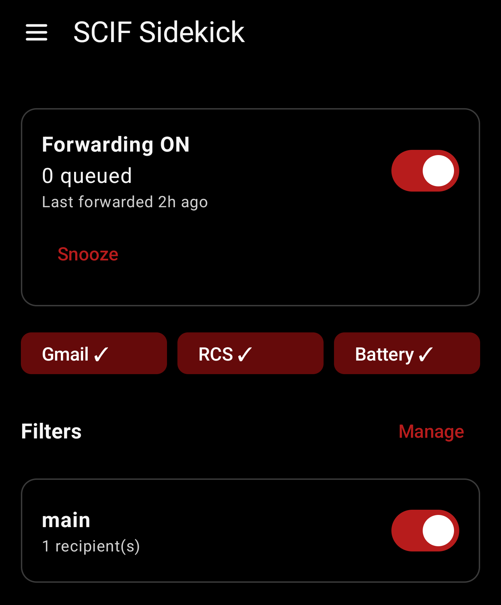
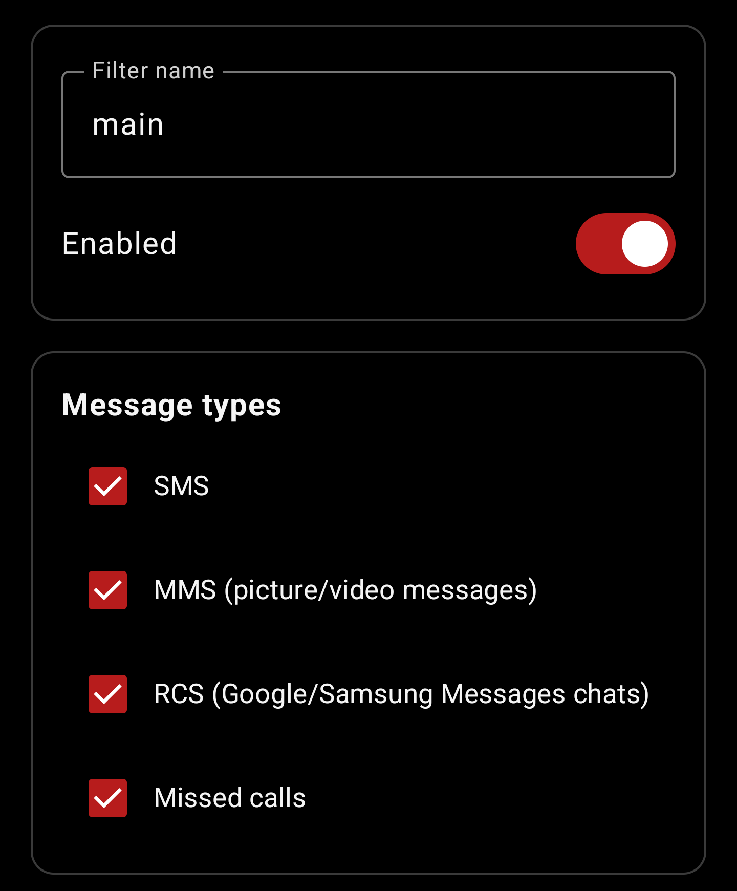
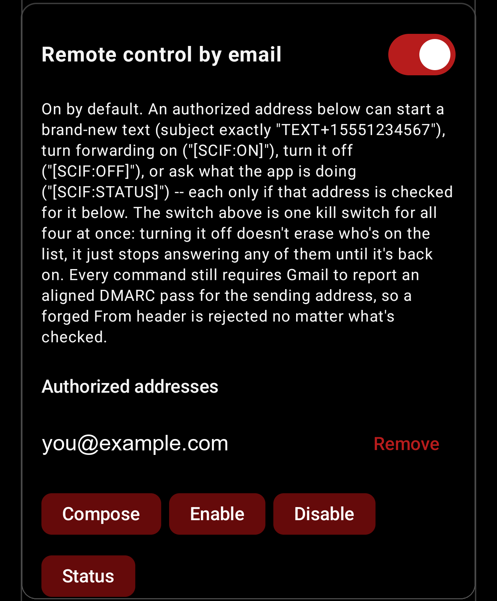

<div align="center">

# 📡 SCIF Sidekick

**Your phone stays in the locker. Your texts don't.**

Personal phones can't go into a SCIF, which leaves you out of reach for hours at a time. SCIF Sidekick runs on your phone while it's locked away: it forwards your SMS, MMS, RCS and missed calls to email, and turns your email replies back into texts. Your family, your school, your plans keep moving, and you never carry the phone past the door.

> **Not an official or approved tool.** SCIF Sidekick is an independent open-source project, not affiliated with or endorsed by any government agency. Follow your organization's rules on personal email and messages at work. Provided as is, with no warranty.


[Quick Start](#-quick-start) · [Features](#-features) · [Email Commands](#-email-commands) · [Filters](#-filters) · [Setup](#-gmail-setup) · [Install](#-install) · [Troubleshooting](#-troubleshooting) · [Docs](#-docs)

</div>

---

<div align="center">

&nbsp;

&nbsp;

<br/>
<sub>Main screen &nbsp;·&nbsp; Filter editor &nbsp;·&nbsp; Remote control by email</sub>
</div>

## ✨ Features

| | Feature | What it does |
|---|---|---|
| 📨 | **Forward everything** | SMS, MMS (with photos), RCS and missed calls land in Gmail as normal emails. |
| 💬 | **Reply by email** | Hit reply on a forward. Your answer is sent as an SMS. Keep the `[SCIF:+1555…]` tag in the subject. |
| ✍️ | **Start a new text** | Email a subject of `TEXT+15551234567` and the body is texted out. Attach a photo to send an MMS. |
| 🎛️ | **Filters** | Any number of independent rules: who, what, when, and where it gets sent. |
| 🔌 | **Remote control** | Turn forwarding on, off, or check on it with a one-line email. ON, OFF and STATUS each reply so you know it landed. |
| 🔐 | **OTP-safe** | Verification codes can bypass your contact and keyword rules so a bank code never gets filtered out. |
| 💓 | **Heartbeat** | Optional "still alive" email on a schedule. If it goes quiet, something broke. |
| ⚡ | **Fast** | Forwarded within seconds of arrival. Email replies are picked up in about 30 seconds, or faster with Gmail push. |
| 🛡️ | **Built-in limits** | Rolling email and text caps, a premium-rate number block and a circuit breaker so a bug can never flood your inbox or run up your carrier bill. |
| 🔒 | **App lock & backup** | Biometric or screen-lock gate, plus export and restore of all your filters and settings. |

---

## 🚀 Quick Start

1. **Build and install** the app (see [Build](#-build)).
2. **Grant permissions**: SMS, MMS, contacts (optional), notifications.
3. **Allow notification access** in the *RCS coverage* card so Google Messages and Samsung Messages chats are picked up.
4. **Allow reliable background operation** and approve the battery exemption.
5. **Connect Gmail** (one-time [Google Cloud setup](#-gmail-setup)).
6. **Add a filter** from the menu with at least one recipient.
7. **Turn forwarding ON.**

> 📱 **Samsung?** Also set *Settings → Apps → SCIF Sidekick → Battery → Unrestricted* and remove it from Sleeping apps.

---

## 📬 Email Commands

Everything below is done from any email client. Put the command in the **subject**; tags are not case-sensitive.

| Command | Subject | Body | What happens | You get back |
|---|---|---|---|---|
| **Send a text** | `TEXT+15551234567` | Your message | Texts that number. Attach a photo to send an MMS. | Nothing, it's a text |
| **Reply to a text** | Hit *Reply* on a forward. Leave the `[SCIF:+15551234567]` tag alone. | Your reply | Texts the original sender | Nothing, it's a text |
| **Forwarding on** | `[SCIF:ON]` | ignored | Turns forwarding on, even if the app is idle | ✅ "Forwarding ENABLED" receipt plus status |
| **Forwarding off** | `[SCIF:OFF]` | ignored | Turns forwarding off | ✅ "Forwarding DISABLED" receipt plus status |
| **Status** | `[SCIF:STATUS]` | ignored | Changes nothing | 📊 On/off, service health, Gmail auth, queue depth |

| Command | Speed | Works while forwarding is off? | Permission needed |
|---|---|---|---|
| Send a text | ~30 sec | ❌ No | *Compose* |
| Reply to a text | ~30 sec | ❌ No | Must be an original recipient of that forward |
| `[SCIF:ON]` | ~15 min (Android may delay longer while idle) | ✅ That's its job | *Enable* |
| `[SCIF:OFF]` | ~30 sec | n/a | *Disable* |
| `[SCIF:STATUS]` | ~30 sec on, ~15 min off | ✅ Yes | *Status* |

**Syntax rules**

- `TEXT+` is followed by the number with country code, digits only, no spaces or dashes: `TEXT+15551234567`. It must be the **entire subject**. Extra words make the app ignore it.
- A text can be at most 1,600 characters and 10 SMS segments, whichever limit is hit first: about 1,500 plain characters, or about 670 with emoji or non-Latin letters. Longer or blank messages are blocked.
- Only the new part of your reply is sent. Quoted history is stripped.
- For `[SCIF:ON]`, `[SCIF:OFF]` and `[SCIF:STATUS]` the tag can sit anywhere in the subject, so a `Re:` or `Fwd:` prefix is fine.
- A subject containing both `[SCIF:ON]` and `[SCIF:OFF]` is ignored as ambiguous.

**How it stays safe**

- 🔑 Each address in **Settings → Remote control by email** has its own checkboxes for *Compose, Enable, Disable, Status*. Trusting someone for one never implies another. A new address starts with all four checked, so untick what they shouldn't have.
- ✉️ The sender must pass Gmail's DMARC check. The visible `From` line alone is never trusted.
- 🤐 **Unauthorized senders get no reply**, so a stranger can't use the app to confirm your mailbox is live. Rejections are logged in History as security events.
- 🧾 Receipts read the state back after the change, so they report what happened, not what was asked.
- 🔕 One master switch turns all of it off.


---

## 🎛 Filters

Forwarding is a stack of filters you manage from the menu. A message is checked against every enabled filter, and each match sends its own email.

| Setting | Options |
|---|---|
| **Message types** | SMS, MMS, RCS, missed calls, any mix |
| **Recipients** | One or more email addresses |
| **Conditions** | Forward all, or by sender allow/block list and keyword must-contain/must-not-contain |
| **OTP bypass** | Verification codes skip contact and keyword rules (on by default) |
| **Template** | Custom subject and body with `{Incoming Number}` `{Contact Name}` `{Message Body}` `{Received Time}` `{Source}` `{Reply Tag}` `{Verb}`, plus find-and-replace rules |
| **Schedule** | Active days and hours, including overnight windows like 22:00–06:00 |
| **Order** | Drag to reorder. "Stop processing further filters" works like an email client rule |
| **Per filter** | Save to history, notify on send |

> Leave `[{Reply Tag}]` in your template's subject. Without it, forwards from that filter can't be replied to.

---

## ☁ Gmail Setup

Google no longer allows custom OAuth redirects on Android, so SCIF Sidekick uses the Google Identity Services authorization API. No client secret or `google-services.json` is needed, and the app never stores a token.

1. Create a Google Cloud project and enable the **Gmail API**.
2. Set OAuth consent to **External**, add your Gmail as a test user, then **publish to production**. Don't leave it in *Testing*: Google expires those grants after 7 days and the app can't tell you, because email is the thing that broke. The "unverified app" warning is expected for personal use. The app name and support email you enter on the consent screen are shown only on your own sign-in screen, so use a neutral name and an address you don't mind seeing there.
3. Add scopes `gmail.send` and `gmail.modify`.
4. Create an **Android OAuth client** with package `com.scifsidekick.cleanroom` and your build's SHA-1 (`./gradlew signingReport`).
5. Open the app and tap **Connect Gmail**.

**Optional: Gmail push (beta).** Cuts email-reply latency to roughly 15–20 seconds using your own Pub/Sub topic. Setup is under Settings → Behavior → *Gmail push*, and the full walkthrough is in the [design notes](docs/DESIGN_NOTES.md#gmail-push-beta).

---

## 🔨 Build

You need Android Studio (JDK 17) and Android SDK 37.

```bash
./gradlew testDebugUnitTest assembleDebug
```

The APK lands at `app/build/outputs/apk/debug/app-debug.apk`.

---

## ⚠ Good to Know

| Topic | Detail |
|---|---|
| **MMS photos** | Android doesn't hand a normal SMS app the downloaded photo. The app waits up to ~28 s and reads the single announced message. On a slow connection it may fall back to a text-only notice. |
| **RCS** | Captured from Google/Samsung Messages notifications. Muted or hidden notifications can't be forwarded. Keep RCS enabled. |
| **Android 17 OTPs** | The OS can withhold one-time-passcode SMS from apps for up to 3 hours. Don't rely on this for time-critical codes. |
| **MMS out** | Unverified against real carriers. Images are downscaled conservatively. |
| **Privacy** | Message payloads live in an on-device database and are pruned after 30 days. Android backups are off. *Settings → Hide app content in Recents* blanks the app in the recent-apps screen and blocks screenshots. Your mail goes to Google and your chosen recipients, so secure that mailbox. |
| **Phones only** | The app needs telephony, so tablets and Wi-Fi-only devices aren't supported. |
| **Policy** | Your organization's rules still apply. See the notice at the top. |
| **Play Store** | SMS permissions are restricted. This is built for sideloading. |

---

## 📲 Install

1. Download `app-release.apk` and `app-release.apk.sha256` from the latest [release](../../releases). Until one is published, use [Build](#-build).
2. Check the download: `sha256sum -c app-release.apk.sha256`.
3. On the phone, allow installs from your browser or file manager, open the APK and install it. Android will call it an unknown app because it isn't from an app store.
4. Follow [Quick Start](#-quick-start).

---

## 🩺 Troubleshooting

| Symptom | Check |
|---|---|
| Nothing is forwarded | Forwarding is ON, the Gmail chip has a ✓, at least one enabled filter has a recipient, battery is *Unrestricted*. History shows why a message was skipped. |
| A reply isn't sent as a text | Forwarding must be ON. Keep the `[SCIF:+number]` tag, reply from an address that received the forward, and look for a "Blocked" entry in History. |
| `[SCIF:ON]` does nothing | The sending address needs *Enable*, Gmail must show a DMARC pass for it, and the mail must be unread in your inbox. Allow 15 minutes or more. |
| "Reconnect Gmail" | Open the app and tap Connect Gmail. If your Google Cloud app is still in *Testing*, publish it; those grants expire after 7 days. |
| RCS chats are missing | Notification access is on and Google/Samsung Messages notifications aren't muted. |
| You'd like to know if it stops | Turn on the Heartbeat email. |

---

## 🧹 Uninstall and your data

Uninstalling deletes everything the app stored on the phone (queue, history, settings). Exported backups stay where you saved them. To cut Google access, remove the app under *Google Account → Security → Third-party access* and delete the Google Cloud project you created. Forwarded emails stay in the mailboxes they were sent to until you delete them.

## 🔎 Limits and trust

- Anyone can email a command. Only allowlisted addresses that pass Gmail's DMARC check are obeyed, and only for the permissions you ticked.
- Your Gmail account is the root of trust: whoever controls it can read every forward and give commands. Use 2-step verification.
- Forwarded text passes through Google and your recipients' mail providers. The on-phone database is protected by Android's app sandbox, not extra encryption.
- This is a convenience tool, not a security product.

---

## 📖 Docs

- [CHANGELOG.md](CHANGELOG.md): what changed in each release ([the long version](docs/CHANGELOG_DETAILED.md) has the reasoning)
- [docs/DESIGN_NOTES.md](docs/DESIGN_NOTES.md): safety invariants and the reasoning behind the design
- [docs/ARCHITECTURE.md](docs/ARCHITECTURE.md): how the pieces fit together
- [docs/TEST_PLAN.md](docs/TEST_PLAN.md): device checks
- [docs/QA_AUDIT.md](docs/QA_AUDIT.md): the 1.1.0 audit
